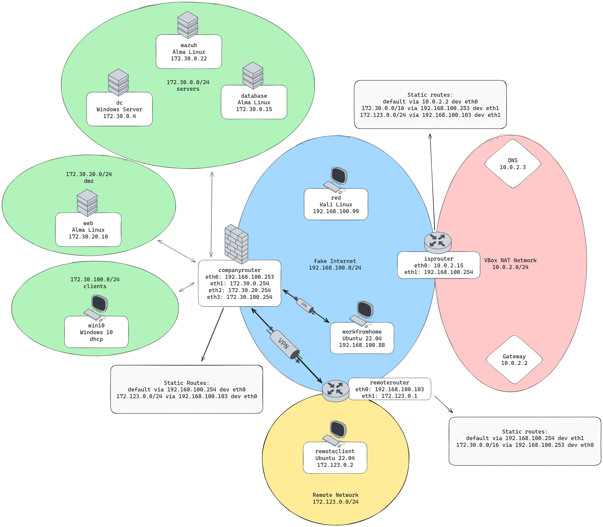

# Cybersecurity Lab Exercises

This repo contains my notes and write-ups of all the practical labs I 
worked on during the course "Cybersecurity Advanced" at HOGENT.

> If this is useful to a student, you're welcome! But just keep in mind that you won't learn anything unless you try stuff out (and fail) yourself ;)
>

## Topics

The course covered many topics, including:

- Enumerating, analysing & segmenting an existing network
- Configuring host-based & network firewalls using `nftables`
- creating a `ssh` client config to properly manage all machines
- configuring `suricata` as an IDS
- setting up a SSH Honeypot
- implement a backup solution using `borgbackup` 
- setting up a SIEM (Wazuh) and monitor Linux & Windows clients
- creating IPSec & OpenVPN tunnels
- utilising `ansible` for system hardening & threat hunting

# Contents

- `exercises/` - contains all writeups
- `notes/` - contains additional notes & research
- `scripts/` - contains some configuration files & scripts used in the exercises
- `csa_vagrant` - contains a Vagrant configuration used to setup additional vms

## Network overview

This is the final diagram of the environment I've been working on:

