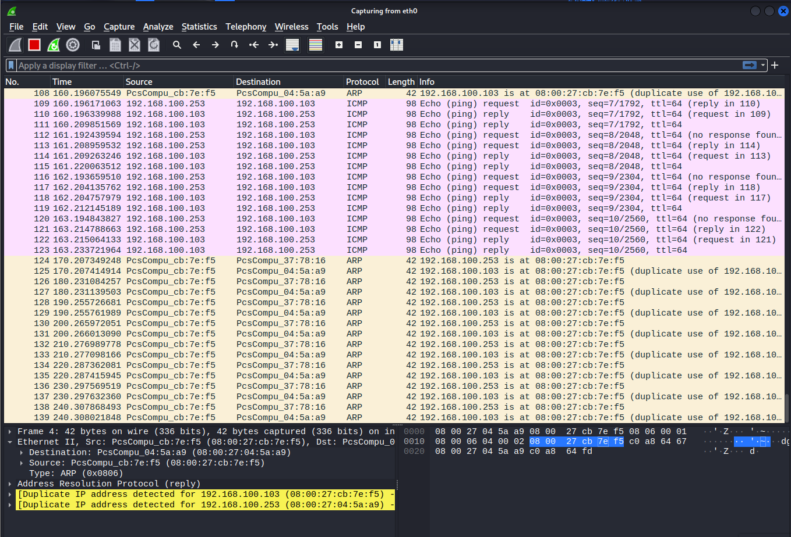
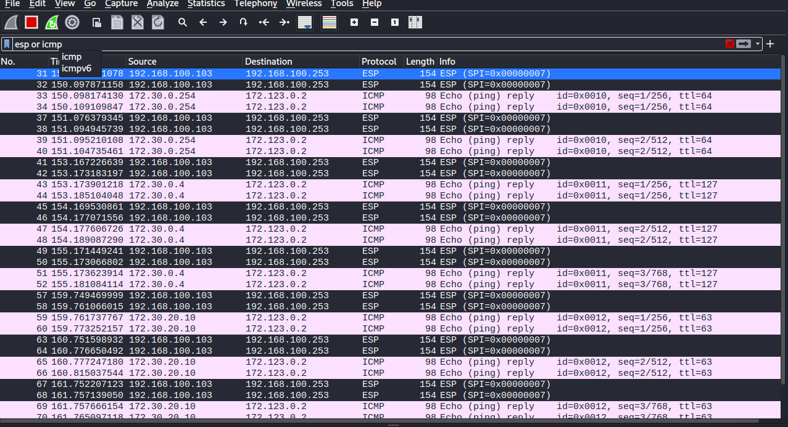
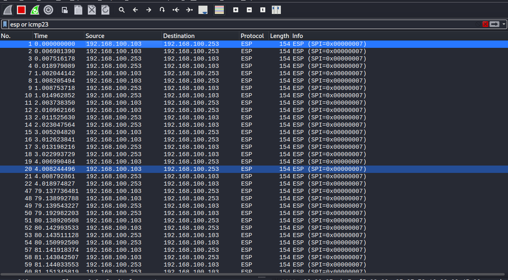

# Pre: MitM attack

> The fake internet network has `red` in the same network as both routers `companyrouter` and `remoterouter`. We will set-up a man-in-the-middle attack, allowing us to inspect the IP packets that are sent between the `companyrouter` and the `remoterouter`. ARP spoofing will redirect traffic to red on which Wireshark will allow you to inspect traffic (and see if you have IPsec working, or not).
> 
> ARP spoofing can be done using the ettercap tool:
> 
> ```
> sudo ettercap -Tq -i <interface> -M arp:remote /<leftIP>// /<rightIP>//
> ```
> 
> where you have to figure out the following information:
> 
>     <interface>: the interface you use on red.
>     <leftIP>: the one side of the connection you try to capture, in casu remoterouter.
>     <rightIP>: the other side of the connection you try to capture, in casu companyrouter.
> 
> Once you can redirect all traffic to red, it is just a matter of running Wireshark on the correct interface.
> 
> Task: can you intercept a ping from remoteclient to a VM behind companyrouter?
> 
> More information can be found at https://whisperlab.org/introduction-to-hacking/notes/ettercap .
>

## ARP Poisoning attack

- Left IP: remoterouter
- Right IP: companyrouter
- red Interface: eth0

```sh
sudo ettercap -Tq -i eth0 -M arp:remote /192.168.100.103// /192.168.100.253//
```



# IPSec 

## Encryption from remoterouter to companyrouter


### IPSec script on `remoterouter`

```sh
#!/usr/bin/env sh

# Manual IPSec

## The first SA vars for the tunnel from remoterouter to companyrouter

SPI7=0x007
ENCKEY7=0xFEDCBA9876543210FEDCBA9876543210

## Activate the tunnel from remoterouter to companyrouter

### Define the SA (Security Association)

ip xfrm state add \
    src 192.168.100.103 \
    dst 192.168.100.253 \
    proto esp \
    spi ${SPI7} \
    mode tunnel \
    enc aes ${ENCKEY7}

### Set up the SP using this SA

ip xfrm policy add \
    src 172.123.0.0/24 \
    dst 172.30.0.0/16 \
    dir out \
    tmpl \
    src 192.168.100.103 \
    dst 192.168.100.253 \
    proto esp \
    spi ${SPI7} \
    mode tunnel
```


### IPSec script on `companyrouter`

```sh
#!/usr/bin/env sh

# Manual IPSec

## The first SA vars for the tunnel from remoterouter to companyrouter

SPI7=0x007
ENCKEY7=0xFEDCBA9876543210FEDCBA9876543210

## Activate the tunnel from remoterouter to companyrouter

### Define the SA (Security Association)

ip xfrm state add \
    src 192.168.100.103 \
    dst 192.168.100.253 \
    proto esp \
    spi ${SPI7} \
    mode tunnel \
    enc aes ${ENCKEY7}

### Set up the SP using this SA

# 'in' policy only works with own interfaces
ip xfrm policy add \
    src 172.123.0.0/24 \
    dst 172.30.0.0/16 \
    dir in \
    tmpl \
    src 192.168.100.103 \
    dst 192.168.100.253 \
    proto esp \
    spi ${SPI7} \
    mode tunnel

# extra 'fwd' policy needed to reach hosts in the internal network
ip xfrm policy add \
    src 172.123.0.0/24 \
    dst 172.30.0.0/16 \
    dir fwd \
    tmpl \
    src 192.168.100.103 \
    dst 192.168.100.253 \
    proto esp \
    spi ${SPI7} \
    mode tunnel
```

### Testing One Way IPSec configuration

```sh
oskar@remoteclient:~$ ping 172.30.20.10
PING 172.30.20.10 (172.30.20.10) 56(84) bytes of data.
64 bytes from 172.30.20.10: icmp_seq=1 ttl=61 time=24.7 ms
64 bytes from 172.30.20.10: icmp_seq=2 ttl=61 time=64.2 ms
64 bytes from 172.30.20.10: icmp_seq=3 ttl=61 time=13.6 ms
```




## Encryption from companyrouter to remoterouter

### IPSec Out Script on companyrouter

```sh
#!/usr/bin/env sh

# Manual IPSec

## The first SA vars for the tunnel from companyrouter to remoterouter

SPI7=0x007
ENCKEY7=0xd280167a0f8af26085005d87a034e5f43b58b8a0106e3e09

## Activate the tunnel from companyrouter to remoterouter

### Define the SA (Security Association)

ip xfrm state add \
    src 192.168.100.253 \
    dst 192.168.100.103 \
    proto esp \
    spi ${SPI7} \
    mode tunnel \
    enc aes ${ENCKEY7}

### Set up the SP using this SA

ip xfrm policy add \
    src 172.30.0.0/16 \
    dst 172.123.0.0/24 \
    dir out \
    tmpl \
    src 192.168.100.253 \
    dst 192.168.100.103 \
    proto esp \
    spi ${SPI7} \
    mode tunnel
```

### IPSec In/Fwd Script on remoterouter

```sh
#!/usr/bin/env sh

# Manual IPSec

## The first SA vars for the tunnel from companyrouter to remoterouter

SPI7=0x007
ENCKEY7=0xd280167a0f8af26085005d87a034e5f43b58b8a0106e3e09

## Activate the tunnel from companyrouter to remoterouter

### Define the SA (Security Association)

ip xfrm state add \
    src 192.168.100.253 \
    dst 192.168.100.103 \
    proto esp \
    spi ${SPI7} \
    mode tunnel \
    enc aes ${ENCKEY7}

### Set up the SP using this SA

ip xfrm policy add \
    src 172.30.0.0/16 \
    dst 172.123.0.0/24 \
    dir in \
    tmpl \
    src 192.168.100.253 \
    dst 192.168.100.103 \
    proto esp \
    spi ${SPI7} \
    mode tunnel

ip xfrm policy add \
    src 172.30.0.0/16 \
    dst 172.123.0.0/24 \
    dir fwd \
    tmpl \
    src 192.168.100.253 \
    dst 192.168.100.103 \
    proto esp \
    spi ${SPI7} \
    mode tunnel
```

### Testing two way IPSec configuration

tested:
- remoteclient <-> web : works ^o^
- remoterouter <-> companyrouter : does not encrypt traffic




