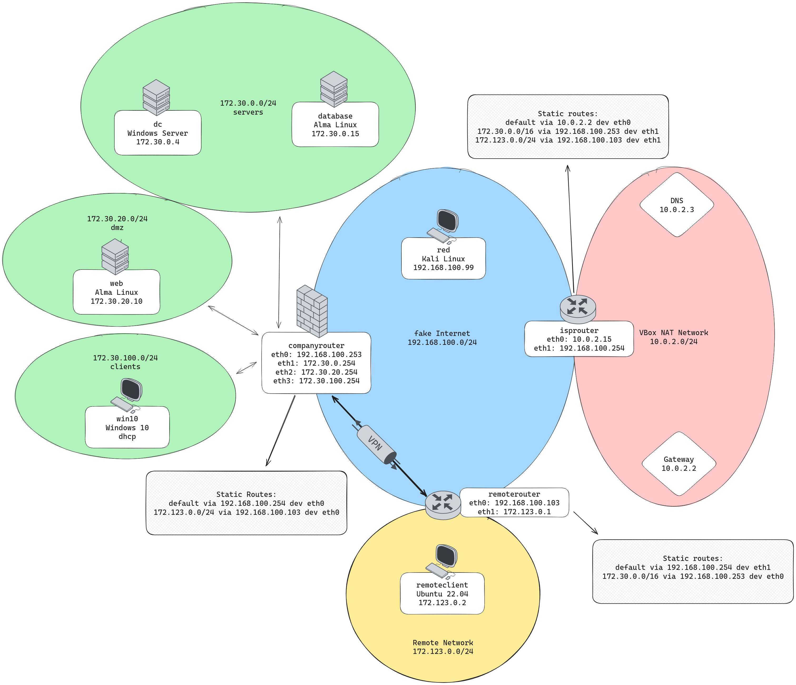

# Remote VMs Setup

IPsec in tunnel mode is typically set-up between two routers. the companyrouter can be used as a first endpoint. The second endpoint is a new Debian VM which connects the internal network remote to the internet. This internal network has the range 172.123.0.0/24.

Create 2 new VM's:

    A Debian server remoterouter, having two interfaces:

        An interface connected to the host-only network (the fake internet) using 192.168.56.103 as IP address.

        An interface connected to the internal network called remote. You have two options to assign an IP address to remoteclient. We leave the decision up to you, just make sure remoteclient can reach the remoterouter and the internet.
            You either assign a fixed IP-address
            You configure remoterouter as an DHCP server

    An Ubuntu Server remoteclient as a client, with just one interface:
        An interface connected to the internal network called remote.

Make sure that:

    Routing is enabled on remoterouter.
    remoteclient has internet connection (including DNS).
    remoteclient can reach all other VM's (for now, you may disable the firewall on companyrouter.).

This will require that you'll add routes in various places. Make a drawing of the network and show it to the teacher! This makes sure that you understand correctly how the network should be configured, and that you do the right thing. This will get confusing very fast if you don't have a visual diagram of the network!

## VM Setup

- cd into `csa_vpn_vms`
- run `vagrant up`, this creates remoterouter & remoteclient

Our desired network configuration looks like:

- remoterouter
  - new user oskar created for remote administration
  - internal interface (remote): eth0 - `172.123.0.1`
  - hostonly interface: eth1 - `192.168.56.103`
  - dns: `10.0.2.3`
  - gateway: isprouter `192.168.100.254`
  - routing enabled

- remoteclient
  - new user oskar created for remote administration
  - internal interface (remote): eth0 - `172.123.0.2`
  - dns: `10.0.2.3`
  - gateway: `172.123.0.1`

### Basic Configuration

on both machines

```shell
# add oskar user
sudo useradd -s /bin/bash -G sudo,users --create-home oskar

# update default editor to vi
sudo update-alternatives --config editor

# if sudo requires a password, add oskar to the sudoers with nopasswd in /etc/sudoers.d/
# oskar ALL=(ALL) NOPASSWD:ALL

sudo su - oskar

# add host public key as oskar
cat << EOF > .ssh/authorized_keys
<public key>
EOF

# on host: test connection
ssh oskar@ip

# for jumping to remoteclient
ssh -J remoterouter oskar@172.123.0.2

# if successful: add ssh local config
```

Hint: change keymaps in terminal
```
sudo dpkg-reconfigure keyboard-configuration
sudo setupcon
```

### IP Configuration

Debian: https://wiki.debian.org/NetworkConfiguration#A3_ways_to_configure_the_network

**remoterouter**

```shell
oskar@remoterouter:~$ cat /etc/network/interfaces
# This file describes the network interfaces available on your system
# and how to activate them. For more information, see interfaces(5).

source /etc/network/interfaces.d/*

# The loopback network interface
auto lo
iface lo inet loopback

auto eth0 
iface eth0 inet static
    address 192.168.100.103
    netmask 255.255.255.0
    gateway 192.168.100.254 # primary interface apparently has to define the default gateway
    dns-nameservers 10.0.2.3

auto eth1
iface eth1 inet static
    address 172.123.0.1
    netmask 255.255.255.0


post-up ip route add 172.30.0.0/16 via 192.168.100.253

$ sudo systemctl restart networking
```


- uncomment this line in `/etc/sysctl.d/99-sysctl.conf` to enable routing
```conf
net.ipv4.ip_forward=1
```
- reboot the system!

**remoteclient**


> Ubuntu network config: https://ubuntu.com/server/docs/network-configuration

```yml
# /etc/netplan/01-config.yaml
network:
  version: 2
  renderer: networkd
  ethernets:
    eth0:
      dhcp4: false
      addresses:
        - 172.123.0.2/24
      routes:
        - to: default
          via: 172.123.0.1
      nameservers:
          addresses:
            - 10.0.2.3
```
- remove all other present netplan files
- run `sudo netplan apply`

### Routes

At least the **isprouter** needs a static route to the remote network in order to route traffic back:

```shell
# /etc/network/interfaces
[...]
post-up ip route add 172.123.0.0/24 via 192.168.100.103
```
```sh
$ /etc/init.d/network restart
```

Routes `remote -> company`, `company -> remote` are not strictly necessary with the isprouter in place which knows all networks.

**companyrouter**
```sh
sudo nmcli connection modify eth0 +ipv4.routes "172.123.0.0/24 192.168.100.103"
```

**remoterouter**
```sh
```shell
# /etc/network/interfaces
[...]
post-up ip route add 172.123.0.0/24 via 192.168.100.103
```
```sh
$ /etc/init.d/network restart
```

## Network diagram

