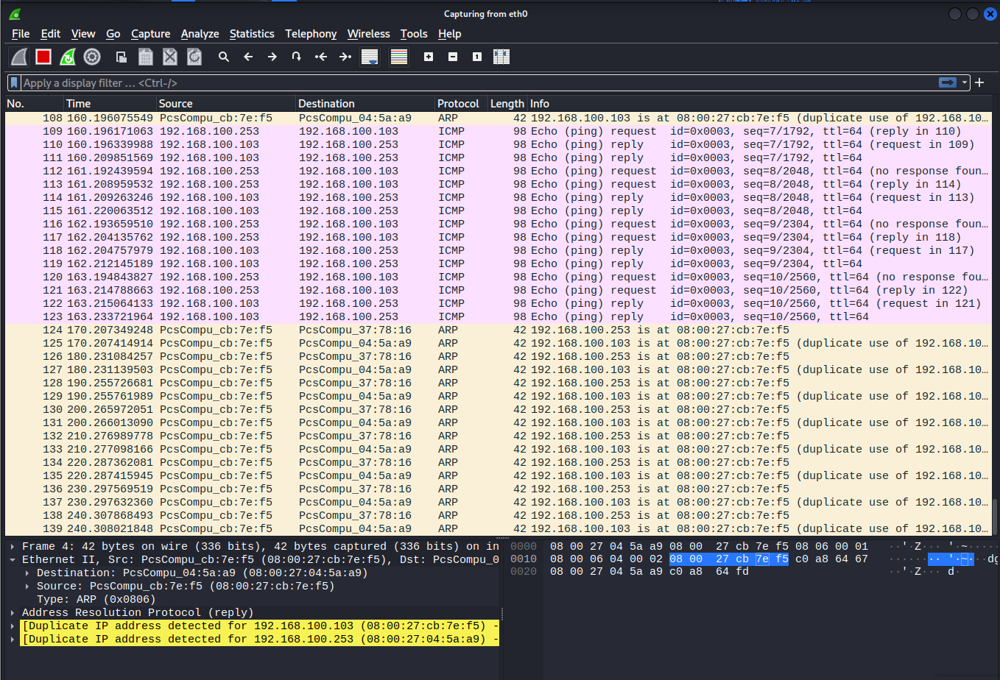

# Pre: MitM attack

> The fake internet network has `red` in the same network as both routers `companyrouter` and `remoterouter`. We will set-up a man-in-the-middle attack, allowing us to inspect the IP packets that are sent between the `companyrouter` and the `remoterouter`. ARP spoofing will redirect traffic to red on which Wireshark will allow you to inspect traffic (and see if you have IPsec working, or not).
> 
> ARP spoofing can be done using the ettercap tool:
> 
> ```
> sudo ettercap -Tq -i <interface> -M arp:remote /<leftIP>// /<rightIP>//
> ```
> 
> where you have to figure out the following information:
> 
>     <interface>: the interface you use on red.
>     <leftIP>: the one side of the connection you try to capture, in casu remoterouter.
>     <rightIP>: the other side of the connection you try to capture, in casu companyrouter.
> 
> Once you can redirect all traffic to red, it is just a matter of running Wireshark on the correct interface.
> 
> Task: can you intercept a ping from remoteclient to a VM behind companyrouter?
> 
> More information can be found at https://whisperlab.org/introduction-to-hacking/notes/ettercap .
>

## ARP Poisoning attack

- Left IP: remoterouter
- Right IP: companyrouter
- red Interface: eth0

```sh
sudo ettercap -Tq -i eth0 -M arp:remote /192.168.100.103// /192.168.100.253//
```



