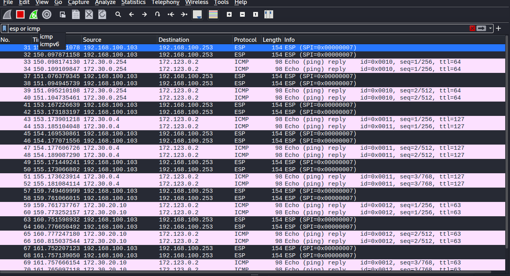
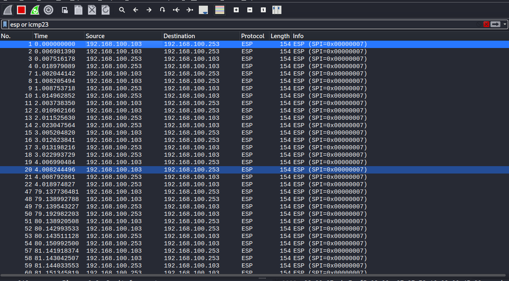

# IPSec 

## Encryption from remoterouter to companyrouter


### IPSec script on `remoterouter`

`ipsec_out.sh`
```sh
#!/usr/bin/env sh

# Manual IPSec

## The first SA vars for the tunnel from remoterouter to companyrouter

SPI7=0x007
ENCKEY7=0xFEDCBA9876543210FEDCBA9876543210 # pre shared key -> used for IKE

## Activate the tunnel from remoterouter to companyrouter

### Define the SA (Security Association)

ip xfrm state add \
    src 192.168.100.103 \
    dst 192.168.100.253 \
    proto esp \
    spi ${SPI7} \
    mode tunnel \
    enc aes ${ENCKEY7}

### Set up the SP using this SA

ip xfrm policy add \
    src 172.123.0.0/24 \
    dst 172.30.0.0/16 \
    dir out \
    tmpl \
    src 192.168.100.103 \
    dst 192.168.100.253 \
    proto esp \
    spi ${SPI7} \
    mode tunnel
```


### IPSec script on `companyrouter`

`ipsec_in_fwd.sh`
```sh
#!/usr/bin/env sh

# Manual IPSec

## The first SA vars for the tunnel from remoterouter to companyrouter

SPI7=0x007
ENCKEY7=0xFEDCBA9876543210FEDCBA9876543210 # pre shared key -> used for IKE

## Activate the tunnel from remoterouter to companyrouter

### Define the SA (Security Association)

ip xfrm state add \
    src 192.168.100.103 \
    dst 192.168.100.253 \
    proto esp \
    spi ${SPI7} \
    mode tunnel \
    enc aes ${ENCKEY7}

### Set up the SP using this SA

# 'in' policy only works with own interfaces
ip xfrm policy add \
    src 172.123.0.0/24 \
    dst 172.30.0.0/16 \
    dir in \
    tmpl \
    src 192.168.100.103 \
    dst 192.168.100.253 \
    proto esp \
    spi ${SPI7} \
    mode tunnel

# extra 'fwd' policy needed to reach hosts in the internal network
ip xfrm policy add \
    src 172.123.0.0/24 \
    dst 172.30.0.0/16 \
    dir fwd \
    tmpl \
    src 192.168.100.103 \
    dst 192.168.100.253 \
    proto esp \
    spi ${SPI7} \
    mode tunnel
```

### Testing One Way IPSec configuration

```sh
oskar@remoteclient:~$ ping 172.30.20.10
PING 172.30.20.10 (172.30.20.10) 56(84) bytes of data.
64 bytes from 172.30.20.10: icmp_seq=1 ttl=61 time=24.7 ms
64 bytes from 172.30.20.10: icmp_seq=2 ttl=61 time=64.2 ms
64 bytes from 172.30.20.10: icmp_seq=3 ttl=61 time=13.6 ms
```




## Encryption from companyrouter to remoterouter

### IPSec Out Script on companyrouter

```sh
#!/usr/bin/env sh

# Manual IPSec

## The first SA vars for the tunnel from companyrouter to remoterouter

SPI7=0x007
ENCKEY7=0xd280167a0f8af26085005d87a034e5f43b58b8a0106e3e09 # new pre shared key -> used for IKE

## Activate the tunnel from companyrouter to remoterouter

### Define the SA (Security Association)

ip xfrm state add \
    src 192.168.100.253 \
    dst 192.168.100.103 \
    proto esp \
    spi ${SPI7} \
    mode tunnel \
    enc aes ${ENCKEY7}

### Set up the SP using this SA

ip xfrm policy add \
    src 172.30.0.0/16 \
    dst 172.123.0.0/24 \
    dir out \
    tmpl \
    src 192.168.100.253 \
    dst 192.168.100.103 \
    proto esp \
    spi ${SPI7} \
    mode tunnel
```

### IPSec In/Fwd Script on remoterouter

```sh
#!/usr/bin/env sh

# Manual IPSec

## The first SA vars for the tunnel from companyrouter to remoterouter

SPI7=0x007
ENCKEY7=0xd280167a0f8af26085005d87a034e5f43b58b8a0106e3e09 # pre shared key -> used for IKE

## Activate the tunnel from companyrouter to remoterouter

### Define the SA (Security Association)

ip xfrm state add \
    src 192.168.100.253 \
    dst 192.168.100.103 \
    proto esp \
    spi ${SPI7} \
    mode tunnel \
    enc aes ${ENCKEY7}

### Set up the SP using this SA

ip xfrm policy add \
    src 172.30.0.0/16 \
    dst 172.123.0.0/24 \
    dir in \
    tmpl \
    src 192.168.100.253 \
    dst 192.168.100.103 \
    proto esp \
    spi ${SPI7} \
    mode tunnel

ip xfrm policy add \
    src 172.30.0.0/16 \
    dst 172.123.0.0/24 \
    dir fwd \
    tmpl \
    src 192.168.100.253 \
    dst 192.168.100.103 \
    proto esp \
    spi ${SPI7} \
    mode tunnel
```

### Testing two way IPSec configuration

tested:
- remoteclient <-> web : works ^o^
- remoterouter <-> companyrouter : does not encrypt traffic




## TL;DR: Tunnel Setup

- copy `ipsec_out.sh` and `ipsec_in_fwd.sh` to their resp. machines

- remote -> company
```sh
# remoterouter
sudo ./ipsec_out.sh

# companyrouter
sudo ./ipsec_in_fwd.sh
```

- company -> remote
```sh
# companyrouter
sudo ./ipsec_out.sh

# remoterouter
sudo ./ipsec_in_fwd.sh
```