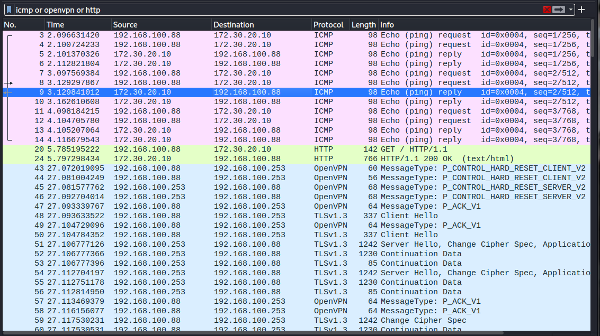

# OpenVPN Practical installation

## Install OpenVPN and EasyRSA package

```sh
# enable epel repo if needed
sudo dnf config-manager --set-enabled crb
sudo dnf install epel-release

# install packages
sudo dnf install openvpn easy-rsa
```

> We will configure companyrouter as an OpenVPN server. Next, we'll create a new Ubuntu Server VM called workathome as a client in the fake internet. Monitoring your traffic can be done with ettercap on red (see the previous lab).
>

## PKI Setup

**Add `easyrsa` binary to path**
- `find / -name easyrsa`
- add path `/usr/share/easy-rsa/3.1.6` to `$PATH` in `~/.bashrc` and re-log-in

> PKI Setup Documentation: https://easy-rsa.readthedocs.io/en/latest/#getting-started-the-basics

```sh
# init PKI
easyrsa init-pki

```

> An Easy-RSA PKI contains the following directory structure:
> - `private/` - dir with private keys generated on this host
> - `reqs/` - dir with locally generated certificate requests (for a CA imported requests are stored here)

> When building a CA, a number of new files are created by a combination of Easy-RSA and (indirectly) openssl. The important CA files are:
> - `ca.crt` - This is the CA certificate
> - `index.txt` - This is the "master database" of all issued certs
> - `serial` - Stores the next serial number (serial numbers increment)
> - `private/ca.key` - This is the CA private key (security-critical)
> - `certs_by_serial/` - dir with all CA-signed certs by serial number
> - `issued/` - dir with issued certs by commonName

```sh
# create root ca
easyrsa build-ca
```
- CA Key Passphrase: `IloveCybersec`
- CommonName: `company ca`

## Generate server keys and certificate

```sh
# generate keypairs
easyrsa gen-req server
```
- PEM Passphrase: `IloveCybersec`

> ```
> Notice
> ------
> Private-Key and Public-Certificate-Request files created.
> Your files are:
> * req: /home/oskar/pki/reqs/server.req
> * key: /home/oskar/pki/private/server.key
> ```

> https://community.openvpn.net/openvpn/wiki/EasyRSA3-OpenVPN-Howto

```sh
# review the request (server is here the name of the request)
easyrsa show-req server

# sign server cert request and generate certificate (Syntax: {server|client} {request name} - we are signing as a server)
easyrsa sign-req server server

# verify server cert
[oskar@companyrouter ~]$ sudo openssl verify -CAfile /home/oskar/pki/ca.crt  /home/oskar/pki/issued/server.crt
/home/oskar/pki/issued/server.crt: OK
```

## Generate client keys and certificate

```sh
# generate keypairs, omit password
easyrsa gen-req client nopass
```

> Notice
> ------
> Private-Key and Public-Certificate-Request files created.
> Your files are:
> * req: /home/oskar/pki/reqs/client.req
> * key: /home/oskar/pki/private/client.key

```sh
# sign certificate
easyrsa sign-req client client

# verify
[oskar@companyrouter ~]$ sudo openssl verify -CAfile /home/oskar/pki/ca.crt  /home/oskar/pki/issued/client.crt
/home/oskar/pki/issued/client.crt: OK
```

## Generate Diffie Hellman parameters

```sh
easyrsa gen-dh
```
> DH parameters of size 2048 created at:
> * /home/oskar/pki/dh.pem


## Configure the server

> https://community.openvpn.net/openvpn/wiki/HOWTO#Creatingconfigurationfilesforserverandclients

```sh
# sample config files (server.conf & client.conf)
ls -la /usr/share/doc/openvpn/sample/sample-config-files/
```


Copy [server.conf](../scripts/openvpn/server.conf) to `companyrouter`

## Configure the client

- Set up a new Ubuntu VM with Vagrant `workathome`
- Attach to fake internet with IP Address `192.168.100.88`
- add static route to company network if necessary
- create extra user `oskar` and ssh key
- copy client files

```sh
sudo scp oskar@192.168.100.253:/home/oskar/pki/ca.crt .
sudo scp oskar@192.168.100.253:/home/oskar/pki/issued/client.crt .
sudo scp oskar@192.168.100.253:/home/oskar/pki/private/client.key .
```

Copy [client.conf](../scripts/openvpn/client.conf) to `workathome`

## Start

> https://community.openvpn.net/openvpn/wiki/HOWTO#StartinguptheVPNandtestingforinitialconnectivity

```sh
# on companyrouter
sudo openvpn server.conf

# on workathome (authenticate with remote user called the same as local user - linux pam)
sudo openvpn client.conf
```

```sh
# YAY :3
oskar@workathome:~$ curl http://172.30.20.10
<!DOCTYPE html>
<html>
<head>
    <title>Insecure Cyb</title>
</head>
<body>
```

## Verify encryption

- Ettercap on `red` to intercept traffic: 
```sh
sudo ettercap -Tq -i eth0 -M arp:remote /192.168.100.88// /192.168.100.253//
```

- Ping webserver with VPN off and on and monitor in wireshark

