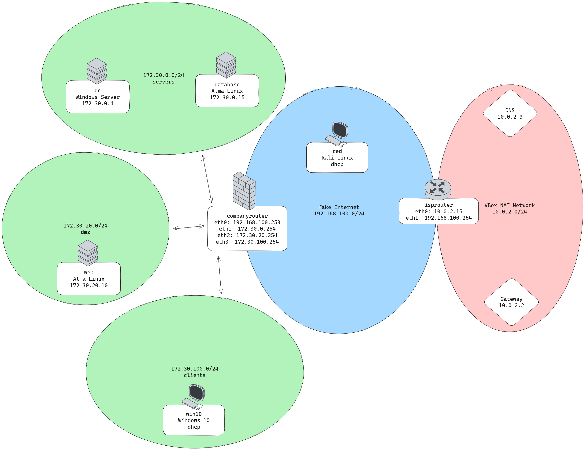

# Network segmentation

- An attack vector in cybersecurity refers to the **method or pathway** that a malicious actor (hacker) uses to exploit vulnerabilities in a computer system or [network](http://network.es)
    - phishing
    - malware
    - vulnerabilities
    - social engineering
- There is no network segmentation present in the base company network.
- In this network, the web  machine should be placed in a DMZ, bc it’s the only machine that has to receive incoming connections from outside the LAN.
- A disadvantage of using network segmentation would be that the interaction of the domain controller might be blocked by a firewall if not all the ports are correctly configured. See above the nmap scan.

## Before

| Hostname | IP           | Subnet        | Gateway        |
|----------|--------------|---------------|----------------|
| dc       | 172.30.0.4   | 172.30.0.0/16 | 172.30.255.254 |
| database | 172.30.0.15  | 172.30.0.0/16 | 172.30.255.254 |
| web      | 172.30.20.10 | 172.30.0.0/16 | 172.30.255.254 |
| win10    | DHCP         | 172.30.0.0/16 | 172.30.255.254 |

**************************************************companyrouter connection**************************************************

```bash
$ sudo cat /etc/NetworkManager/system-connections/Wired\ connection\ 1.nmconnection
[connection]
id=Wired connection 1
uuid=e99d0a4c-39fc-335b-9ab3-a37d77b16f81
type=ethernet
autoconnect-priority=-999
interface-name=eth1

[ethernet]

[ipv4]
address1=172.30.255.254/16
dns-search=insecure.cyb;
method=manual
never-default=true

[ipv6]
addr-gen-mode=default
method=auto

[proxy]
```

## After

| Hostname | IP           | Subnet          | Gateway        | zone    |
|----------|--------------|-----------------|----------------|---------|
| dc       | 172.30.0.4   | 172.30.0.0/24   | 172.30.0.254   | servers |
| database | 172.30.0.15  | 172.30.0.0/24   | 172.30.0.254   | servers |
| web      | 172.30.20.10 | 172.30.20.0/24  | 172.30.20.254  | dmz     |
| win10    | DHCP         | 172.30.100.0/24 | 172.30.100.254 | clients |
| companyrouter | 172.30.0.1, 172.30.20.1, 172.30.100.1, 192.168.56.253| 192.168.56.254 | firewall |

The host companyrouter is configured like this:
```
eth1: 172.30.0.1/24
eth2: 172.30.20.1/24
eth3: 
``` 

- Configure companyrouter to have three seperate internal interfaces
- Change IP configuration on every machine
- create seperate sudo user apart from vagrant

### Companyrouter

****************servers****************

```bash
$ sudo nmcli connection add type ethernet ifname eth1 con-name eth1
$ sudo nmcli connection modify eth1 ipv4.addresses 172.30.0.254/24 ipv4.method manual
$ sudo nmcli reload
```

******dmz******

```bash
$ sudo nmcli connection add type ethernet ifname eth2 con-name eth2
$ sudo nmcli connection modify eth2 ipv4.addresses 172.30.20.254/24 ipv4.method manual
$ sudo nmcli reload
```

**************clients**************

```bash
$ sudo nmcli connection add type ethernet ifname eth3 con-name eth3
$ sudo nmcli connection modify eth3 ipv4.addresses 172.30.100.254/24 ipv4.method manual
$ sudo nmcli reload
```

#### DHCP Server Configuration

Only the client network should be configured via DHCP
```bash
# /etc/dhcp/dhcpd.conf
option domain-name "insecure.cyb";
option domain-name-servers 172.30.0.4;

default-lease-time 600;
max-lease-time 7200;

#ddns-update-style none;

# If this DHCP server is the official DHCP server for the local
# network, the authoritative directive should be uncommented.
authoritative;

# Use this to send dhcp log messages to a different log file (you also
# have to hack syslog.conf to complete the redirection).
log-facility local7;


subnet 172.30.100.0 netmask 255.255.255.0 {
  range 172.30.100.100 172.30.100.200;
  option routers 172.30.100.254;
  option domain-name-servers 172.30.0.4;
  option domain-name "insecure.cyb";
  default-lease-time 600;
  max-lease-time 7200;
}
```

Test the DHCP Server
```bash
[oskar@companyrouter ~]$ sudo nmap --script broadcast-dhcp-discover -e eth3
Starting Nmap 7.91 ( https://nmap.org ) at 2023-11-08 11:14 UTC
Pre-scan script results:
| broadcast-dhcp-discover:
|   Response 1 of 1:
|     Interface: eth3
|     IP Offered: 172.30.100.100
|     DHCP Message Type: DHCPOFFER
|     Server Identifier: 172.30.100.254
|     IP Address Lease Time: 5m00s
|     Subnet Mask: 255.255.255.0
|     Router: 172.30.100.254
|     Domain Name Server: 172.30.0.4
|_    Domain Name: insecure.cyb
```


### Web

```bash
$ sudo nmcli con add type ethernet ifname eth0 con-name eth0
$ sudo nmcli con modify eth0 ipv4.address 172.30.20.10 ipv4.gateway 172.30.20.254 ipv4.method manual ipv4.dns 10.0.2.3 ipv4.dns-search insecure.cyb
$ sudo nmcli reload
```

### Database

```bash
$ sudo nmcli con add type ethernet ifname eth0 con-name eth0
$ sudo nmcli con modify eth0 ipv4.address 172.30.0.15 ipv4.gateway 172.30.0.254 ipv4.method manual ipv4.dns 10.0.2.3 ipv4.dns-search insecure.cyb
$ sudo nmcli reload
```

### Win10

- Set static IP & DNS until DHCP Server on DC is working

```powershell
New-NetIPAddress -InterfaceIndex 6 -IPAddress '172.30.100.101' -PrefixLength 24 -AddressFamiliy IPv4 -DefaultGateway 172.30.100.254
Set-DnsClientServerAddress -InterfaceIndex 6 -ServerAddresses ("172.30.0.4", "10.0.2.3")

# add host route do dc for testing
New-NetRoute -InterfaceIndex 6 -DestinationPrefix '172.30.0.4/32' -AddressFamily IPv4 -NextHop '172.30.100.254' -RouteMetric 0
```

### DC

```powershell
Get-NetIPAddress -IPAddress '172.30.0.4'

# set new ip address
Remove-NetIPAddress -IPAddress '172.30.0.4'
New-NetIPAddress -InterfaceIndex 5 -IPAddress '172.30.0.4' -PrefixLength 24 -AddressFamiliy IPv4

# set new default gateway
Remove-NetRoute -InterfaceIndex 5 -NextHop 172.30.255.254
New-NetRoute -InterfaceIndex 5 -DestinationPrefix '0.0.0.0/0' -AddressFamily IPv4 -NextHop '172.30.0.254' -RouteMetric 0

# create replication subnet
# https://theitbros.com/active-directory-sites-and-subnets/
New-ADReplicationSubnet -Name "172.30.100.0/24" -Site "Default-First-Site-Name"
```

```powershell
PS C:\Users\walt> Get-ADDomainController -Filter * | ft Hostname,Site

Hostname        Site
--------        ----
dc.insecure.cyb Default-First-Site-Name
```

********************************************Configure DHCP Server********************************************

<aside>
🖊️ TODO: Revert!!!

</aside>

```powershell
ssh walt@172.30.0.4

# https://learn.microsoft.com/de-de/windows-server/networking/technologies/dhcp/quickstart-install-configure-dhcp-server?tabs=powershell
Install-WindowsFeature DHCP -IncludeManagementTools

# Add DHCP Server to domain
Add-DhcpServerInDC -DnsName dc.insecure.cyb -IPAddress 172.30.0.4

# configure DHCP range
Add-DhcpServerv4Scope -Name "Insecure Network Clients" -StartRange 172.30.100.100 -EndRange 172.30.100.200 -SubnetMask 255.255.255.0

# Set served DNS servers
Set-DhcpServerv4OptionValue -ScopeId 172.30.100.0 -OptionId 6 -Value "172.30.0.4", "10.0.2.3"

## TODO
```



## Discussion

- ipv4.dns-search=insecure.cyb missing

### Advantages

- more granular configuration possible

### Disadvantages

- more administrative effort needed
- Win10 Client loses access to the Active Directory Domain Controller
    - Fix: point dns server to dc

> Configure the environment, and especially the companyrouter, to make sure that the red machine is **not able to interact with most systems anymore.** The only requirements that are left for the red machine are:
> 
> - Browsing to [http://www.insecure.cyb](http://www.insecure.cyb/) should work. Note: you are allowed to manually add a DNS entry to the red
> machine to tell the system how to resolve "www.insecure.cyb". Do be
> mindful why this is needed!
> - All machines in the company network should still have internet access
> - You should verify what functionality you might lose implementing the
> network segmentation. List out and create an overview of the advantages
> and disadvantages.
> - You should be able to revert back easily --> Create proper documentation!

 