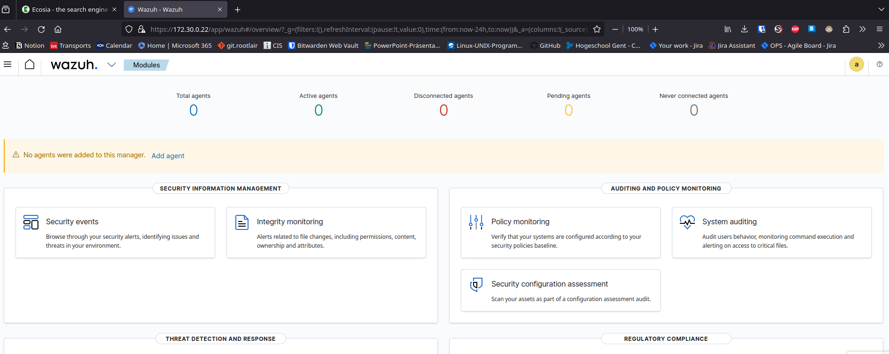

# Wazuh Server

> The instructions of this lab are straightforward. Create a new server in the internal company network that functions as a SIEM. We suggest installing Wazuh Take a look at the installation instructions and take a look at the recommended operating systems and hardware recommendations. We suggest a minimum of 4 GB of memory and to install the indexer, server and dashboard on the same machine. You are free to choose how you install and setup the operating system (osboxes, vagrant, from scratch, ...).

- Installed an AlmaLinux Box with 4G memory & 2 cpus.
- Attached to the servers subnet in company network

## Wazuh indexer 

> Follow this instructions: https://documentation.wazuh.com/current/installation-guide/wazuh-indexer/installation-assistant.html

### Initial config

```sh
curl -sO https://packages.wazuh.com/4.7/wazuh-install.sh

curl -sO https://packages.wazuh.com/4.7/config.yml

# add ip's 
vim config.yml

chmod +x wazuh-install.sh
sudo ./wazuh-install.sh --generate-config-files --ignore-check
```

### Wazuh indexer nodes installation

```sh
sudo ./wazuh-install.sh --wazuh-indexer node-1 -i
```

### Cluster initialization

```sh
sudo ./wazuh-install.sh --start-cluster -i
```

### Testing cluster installation

```sh

# retrieve admin password
sudo tar -axf wazuh-install-files.tar wazuh-install-files/wazuh-passwords.txt -O | grep -P "\'admin\'" -A 1
  indexer_username: 'admin'
  indexer_password: 'QTNe82O3*39.UvVTjtP4EptgWA*pIqPl'

# verify installation
curl -k -u admin:QTNe82O3*39.UvVTjtP4EptgWA*pIqPl https://172.30.0.22:9200

curl -k -u admin:QTNe82O3*39.UvVTjtP4EptgWA*pIqPl https://172.30.0.22:9200/_cat/nodes?v
```

## Wazuh server

> https://documentation.wazuh.com/current/installation-guide/wazuh-server/installation-assistant.html

### Wazuh server cluster installation

```sh
sudo ./wazuh-install.sh --wazuh-server wazuh-1 -i
```

## Wazuh dashboard

> https://documentation.wazuh.com/current/installation-guide/wazuh-dashboard/installation-assistant.html

### Wazuh dashboard installation

```sh
sudo ./wazuh-install.sh --wazuh-dashboard dashboard -i

# retrieve all credentials
sudo tar -O -xvf wazuh-install-files.tar wazuh-install-files/wazuh-passwords.txt
```

### Accessing the dashboard

As I set the host ip as ip for the dashboard, i had to add a route to my host system (and add a firewall rule) in order to access the wazuh dashboard via the right ip (ssh port forwarding didn't work)

```sh
sudo ip route add dev vboxnet1 172.30.0.0/24 via 192.168.100.253
```

Then accessing the dashboard worked:

Credentials:
- `admin`
- `QTNe82O3*39.UvVTjtP4EptgWA*pIqPl`




# Wazuh Agents

> When the installation of the Wazuh server is finished, try and install agents on all Linux hosts of the network. Even alpine is supported if you want to test this out.

> Explore the options of your freshly installed and configured SIEM solution:
> 
> -What is File Integrity Monitoring? Try to monitor the home directory of a user on a specific machine. Create a demo.
> - What is meant with Regulatory Compliance? Give 2 frameworks that can be explored.
>  - Threat hunting: discover the CLI commands that were executed on your machines. For example perform an install of a package or a download a file and create an overview that lists all commands that have been ran on that machine. Create a demo for Linux and Windows hosts.

> Extra information can be found at [Bringing it all together](https://www.youtube.com/watch?v=i68atPbB8uQ) with John Hammond. Feel free to use atomic red team to test your setup.
>

## Linux hosts

```sh
curl -o wazuh-agent-4.7.1-1.x86_64.rpm https://packages.wazuh.com/4.x/yum/wazuh-agent-4.7.1-1.x86_64.rpm && sudo WAZUH_MANAGER='172.30.0.22' WAZUH_AGENT_GROUP='default' WAZUH_AGENT_NAME='companyrouter' rpm -ihv wazuh-agent-4.7.1-1.x86_64.rpm

sudo systemctl daemon-reload
sudo systemctl enable wazuh-agent --now
```

## File integrity monitoring

## Regulatory Compliance

> Wazuh helps implement compliance requirements for regulatory compliance support and visibility. This is done by providing automation, improved security controls, log analysis, and incident response.
>
> The default Wazuh ruleset provides support for PCI DSS, HIPAA, NIST 800-53, TSC, and GDPR frameworks and standards. Wazuh rules and decoders are used to detect attacks, system errors, security misconfigurations, and policy violations.
> -> https://documentation.wazuh.com/current/compliance/index.html


## Threat hunting

# Sysmon

> Sysmon for Windows
> 
> Until now, we have only installed the Wazuh agents on Linux hosts. Now install the Wazuh agent on a Windows client machine: can you do the same as on the Linux machines?
> 
> There is a tool available from Microsoft that enhances Windows logging, called Sysmon. This tool enables us to gain more insight in what happens (or has happened) on a Windows machine, and thus allows us to find and track anomalies or threats. A Wazuh agent on Windows can be configured to process the Sysmon logs so that these can be monitored and processed by Wazuh.
> 
> Wazuh has a blogpost in which Sysmon is installed next to a Wazuh agent. Then, an attack is executed with Mimikatz. This attack should show up in your Wazuh server. Go through the blogpost and make sure you can simulate this yourself!
> 
> TIP: The primary goal of showing a working SIEM (wazuh) setup in this lab is proving that process create events, as well as PowerShell commands executed on the Windows workstation are succesfully registered and retrievable in Wazuh. 
>

## Wazuh agent on Windows

> manual way: https://documentation.wazuh.com/current/installation-guide/wazuh-agent/wazuh-agent-package-windows.html

1. Go to wazuh dashboard -> deploy new agent
2. select windows and enter ip and name
3. copy generated command and run in Powershell on host

> make sure agent name matches hostname!

```ps1
Invoke-WebRequest -Uri https://packages.wazuh.com/4.x/windows/wazuh-agent-4.7.1-1.msi -OutFile ${env.tmp}\wazuh-agent; msiexec.exe /i ${env.tmp}\wazuh-agent /q WAZUH_MANAGER='172.30.0.22' WAZUH_AGENT_GROUP='default' WAZUH_AGENT_NAME='win10' WAZUH_REGISTRATION_SERVER='172.30.0.22' 

net start WazuhSvc
```

## Wazuh Sysmon integration

> TODO finish documentation

> https://wazuh.com/blog/learn-to-detect-threats-on-windows-by-monitoring-sysmon-events/

**Configure wazuh to collect sysmon event**
- Copy configuration to `/var/ossec/etc/rules/local_rules.xml`:
```xml
<group name="windows, sysmon, sysmon_process-anomalies,">
   <rule id="100000" level="12">
     <if_group>sysmon_event1</if_group>
     <field name="win.eventdata.image">mimikatz.exe</field>
     <description>Sysmon - Suspicious Process - mimikatz.exe</description>
   </rule>

   <rule id="100001" level="12">
     <if_group>sysmon_event8</if_group>
     <field name="win.eventdata.sourceImage">mimikatz.exe</field>
     <description>Sysmon - Suspicious Process mimikatz.exe created a remote thread</description>
   </rule>

   <rule id="100002" level="12">
     <if_group>sysmon_event_10</if_group>
     <field name="win.eventdata.sourceImage">mimikatz.exe</field>
     <description>Sysmon - Suspicious Process mimikatz.exe accessed $(win.eventdata.targetImage)</description>
   </rule>
</group>
```
